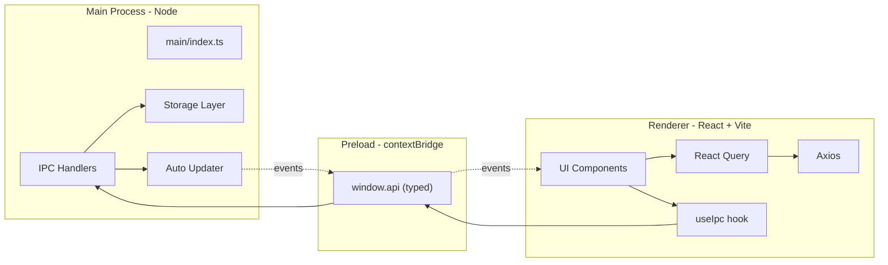

# Architecture

Electron has three logical processes. This project keeps their boundaries
explicit:



## Processes

| Process      | Runtime                   | What lives here                                             | Can it `require('fs')`?   |
| ------------ | ------------------------- | ----------------------------------------------------------- | ------------------------- |
| **main**     | Node.js (Electron bundle) | App lifecycle, windows, IPC handlers, storage, auto-updater | Yes                       |
| **preload**  | Sandboxed Node            | `contextBridge` exposing the typed `window.api`             | Yes (Node built-ins only) |
| **renderer** | Chromium                  | React, Vite, all UI code                                    | No — goes through IPC     |

Security defaults:

- `contextIsolation: true`
- `nodeIntegration: false`
- All renderer↔main communication goes through the typed `window.api.invoke`
  (see [`src/shared/ipc-contract.ts`](../src/shared/ipc-contract.ts)).

## How a request flows

1. Renderer calls `useIpcQuery('store:get', { key: 'theme' })`.
2. The hook delegates to `window.api.invoke(...)`, exposed by
   [`src/preload/index.ts`](../src/preload/index.ts).
3. The preload forwards to `ipcRenderer.invoke` with the same channel + payload.
4. `ipcMain.handle(channel, handler)` — registered by
   [`src/main/ipc/index.ts`](../src/main/ipc/index.ts) — runs the handler.
5. The handler returns (or throws). TanStack Query caches the result by
   `[channel, req]`.

Because the channel → `{ req, res }` map is declared once in
`ipc-contract.ts`, the TypeScript compiler enforces type safety at every layer.
A typo in a channel name, or a mismatched payload, fails the build.

## Event flow (main → renderer)

For server-push style events (e.g. updater status), use `contents.send` on the
main side and `window.api.on(event, cb)` on the renderer. Event name/payload
types come from `IpcEventMap` in `ipc-contract.ts`.

## Build output

`electron-vite` emits:

```
out/
├─ main/index.js
├─ preload/index.js
└─ renderer/
   ├─ index.html
   └─ assets/*
```

`electron-builder` packages everything under `out/` + `package.json` (production
deps only) into OS-specific installers.
